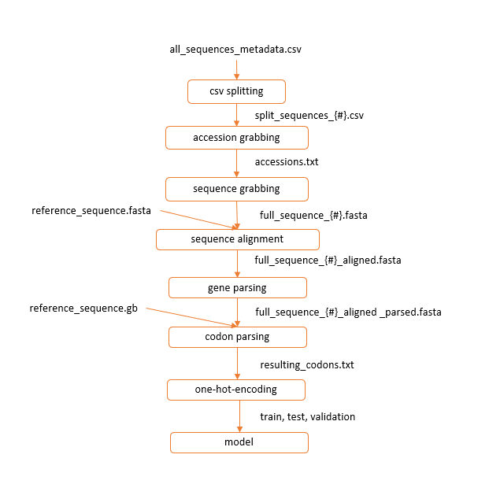

# Recurrent Neural Network for Understanding Sars-Cov-2 Protein Stability 

Allison Li, Jacob Evarts

University of Washington

## Introduction
Our aim is to build a recurrent neural network that takes Sars-cov-2 genomic data and reads codons of the spike protein as ‘words’ in a sentence, similar to natural language processing. By doing this across coronavirus samples and strains, the model should be able to learn not only which amino acids, but which codons typically comprise the protein. Finding patterns in the codon sequence could provide information on protein stability and codon transcription preferences by coronavirus.

### Installations
[Miniconda](https://docs.conda.io/en/latest/miniconda.html) and mamba are required to run the workflow. After installing Miniconda, install mamba using:

`conda install mamba -n base -c conda-forge`

### Creating an Environment
Create an environment to test this Nextstrain workflow.

`mamba env create -n rnn-environment -f envs/config.yaml`

Activate the environment to use the workflow.

`conda activate rnn-environment`

### Getting started with own input files
To run the network on your own virus dataset, you will need to provide all the metadata (GenBank Accession Numbers) to your sequences in the form of a csv file as the input to our data parsing workflow.
Download the virus metadata off of the [BV-BRC Database](https://www.bv-brc.org/). Rename the resulting CSV file as 'all-sequences-metadata.csv' and drop into the 'data' folder. Drop your reference sequence fasta and GenBank file into the 'data' folder and name it as 'reference-sequence.fasta' and 'reference-sequence.gb' respectively.

Run workflow for Mac Users

`python csv-splitting-script.py; python accession-grabbing-script.py; ./alignment-script.sh; ./gene-parse-script.sh; python codon-parsing-script.py`

Run workflow for Windows Users

`python csv-splitting-script.py; python accession-grabbing-script.py; dos2unix alignment_script.sh; ./alignment-script.sh; dos2unix gene-parse-script.sh; ./gene-parse-script.sh; python codon-parsing-script.py`

Alternatively, if you already have the list of accessions, you can forgo some of the above steps for an expedited pipeline. 

Run expedited workflow for Mac Users

`./alignment-script.sh; ./gene-parse-script.sh; python codon-parsing-script.py`

Run expedited workflow for Windows Users

`dos2unix alignment_script.sh; ./alignment-script.sh; dos2unix gene-parse-script.sh; ./gene-parse-script.sh; python codon-parsing-script.py`

     

## Data Curation
All sequence data is from Genbank. We filtered for human coronavirus genomes that are at least 80% complete. 
